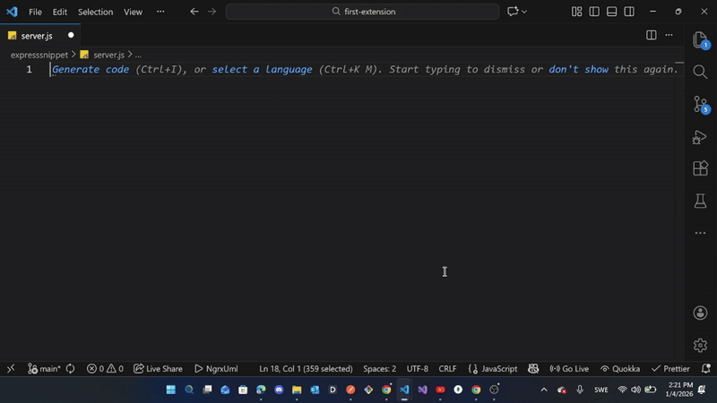

[](https://marketplace.visualstudio.com/items?itemName=Payamaya.node-express-snippets)
[](https://marketplace.visualstudio.com/items?itemName=Payamaya.node-express-snippets)
[](https://marketplace.visualstudio.com/items?itemName=Payamaya.node-express-snippets)

# Node ExpressSnippet for VS Code

Essential Express.js snippets for faster Node.js development. Includes middleware, routing, error handling, and common API patterns to accelerate your Express application development workflow.

## 🚀 Features

- **Quick Express server setup** - Get started in seconds
- **Common route patterns** - GET, POST, PUT, DELETE routes
- **Middleware templates** - Custom middleware with error handling
- **Error handling** - Structured error responses
- **Security** - CORS, Helmet configurations
- **Best practices** - Follows Express.js conventions

### **Multi-Language Support**

- ✅ **JavaScript** - Traditional Node.js/Express snippets
- ✅ **TypeScript** - Type-safe Express development
- ✅ **React JSX** - Frontend integration snippets
- ✅ **React TypeScript** - Full-stack TypeScript support

### **Express.js Essentials**

- **Quick Server Setup** - Generate Express servers in seconds
- **REST API Routes** - GET, POST, PUT, DELETE with error handling
- **Middleware Templates** - Custom middleware patterns
- **Database Integration** - MongoDB, PostgreSQL setups
- **Authentication** - JWT, session-based auth snippets
- **Error Handling** - Structured error responses
- **Security** - CORS, Helmet.js configurations

## Installation

### From VS Code:

1. Open VS Code
2. Press `Ctrl+Shift+X` to open Extensions
3. Search for **"Node ExpressSnippet"**
4. Click **Install**

### From Marketplace:

Visit: [Node ExpressSnippet on VS Code Marketplace](https://marketplace.visualstudio.com/items?itemName=Payamaya.node-express-snippets)

### **Command Line:**

```bash
code --install-extension Payamaya.node-express-snippets
```

## 🎥 Demo



### Quick Start:

1. Create a `.js`,`.ts`,`.jsx`, Or `.tsx` file
2. Type `express-server`(or `express-server-ts` for TypeScript)
3. Press `Tab` to expand

## 📝 Supported Languages & Snippets

### Language Overview

| Language   | File Extensions | key Prefix     | Extensions Snippets  |
| ---------- | --------------- | -------------- | -------------------- |
| JavaScript | `.js`           | `express-`     | `express-server`     |
| TypeScript | `.ts`           | `express-ts`   | `express-server-ts`  |
| React JSX  | `.jsx`          | `exp-react-`   | `exp-fetch-react`    |
| React TSX  | `.tsx`          | `exp-react-ts` | `exp-fetch-react-ts` |

### JavaScript Snippets (`.js` files)

| Prefix           | Description                    |
| ---------------- | ------------------------------ |
| `express-server` | Complete Express server setup  |
| `exp-get`        | GET route with error handling  |
| `exp-post`       | POST route with error handling |
| `exp-middleware` | Custom middleware function     |
| `exp-error`      | Error handling middleware      |
| `exp-params`     | Route with URL parameters      |
| `exp-static`     | Serve static files             |
| `exp-cors`       | CORS configuration             |
| `exp-helmet`     | Security headers with Helmet   |
| `exp-mongodb`    | MongoDB connection & model     |

### TypeScript Snippets (`.ts` files)

| Prefix              | Description                   |
| ------------------- | ----------------------------- |
| `express-server-ts` | TypeScript Express server     |
| `exp-get-ts`        | Type-safe GET route           |
| `exp-post-ts`       | Type-safe POST route          |
| `exp-middleware-ts` | Typed middleware function     |
| `exp-error-ts`      | Type-safe error handler       |
| `exp-env-ts`        | TypeScript environment config |

### React Integration (`.jsx` files)

| Prefix                | Description                  |
| --------------------- | ---------------------------- |
| `exp-fetch-react`     | Fetch data from Express API  |
| `exp-react-component` | React component for API data |

### React TypeScript (`.tsx `files)

| Prefix                   | Description                      |
| ------------------------ | -------------------------------- |
| `exp-fetch-react-ts`     | TypeScript fetch with interfaces |
| `exp-react-component-ts` | Typed React component            |

## Usage

1. Type the snippet prefix (e.g., `express-server`)
2. Press `Tab` to expand
3. Fill in the placeholders using `Tab` to navigate

### 💻 Usage Examples

Type `express-server` and press `Tab`:

```javascript
const express = require('express')
const app = express()
const port = process.env.PORT || 3000

// Middleware
app.use(express.json())
app.use(express.urlencoded({ extended: true }))

// Routes
app.get('/', (req, res) => {
  res.send('Hello World!')
})

// Start server
app.listen(port, () => {
  console.log(`Server running on port ${port}`)
})
```

### TypeScript Example

```typescript
// Type: express-server-ts
import express, { Application, Request, Response } from 'express'
const app: Application = express()
const port: string | number = process.env.PORT || 3000

app.use(express.json())
app.get('/', (req: Request, res: Response) => {
  res.send('Hello World!')
})

app.listen(port, () => {
  console.log(`Server running on port ${port}`)
})
```

## ⚛️ React Examples

```javascript
/// Type: exp-fetch-react
const fetchData = async () => {
  try {
    const response = await fetch('http://localhost:3000/api')
    const data = await response.json()
    return data
  } catch (error) {
    console.error('Error:', error)
    throw error
  }
}
```

## React Typescript Examples

```typescript
// Type: exp-fetch-react-ts
interface ApiResponse<T> {
  success: boolean
  data?: T
  error?: string
}

const fetchData = async <T>(url: string): Promise<T> => {
  try {
    const response = await fetch(url)
    const result: ApiResponse<T> = await response.json()
    return result.data!
  } catch (error) {
    console.error('Error:', error)
    throw error
  }
}
```

## More Examples

### Express GET Route

```javascript
// Type: exp-get
app.get('/api/users', (req, res) => {
  try {
    // Your code here
    res.status(200).json({ success: true, data: result })
  } catch (error) {
    console.error('Error:', error)
    res.status(500).json({ success: false, error: error.message })
  }
})
```

## Contributing

Found a bug or have a suggestion?

1. Open an issue on [GitHub](https://github.com/yourusername/node-express-snippets/issues)
2. Suggest new snippets
3. Report any problems

Want to add more snippets? Feel free to submit a PR!

## Support

If this extension helps you, consider:

- ⭐ Starring the repository
- 📝 Writing a review on the marketplace
- 🐛 Reporting issues
- 💡 Suggesting improvements

## Release Notes

See [CHANGELOG.md](CHANGELOG.md)

## License

MIT License
